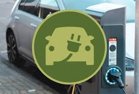
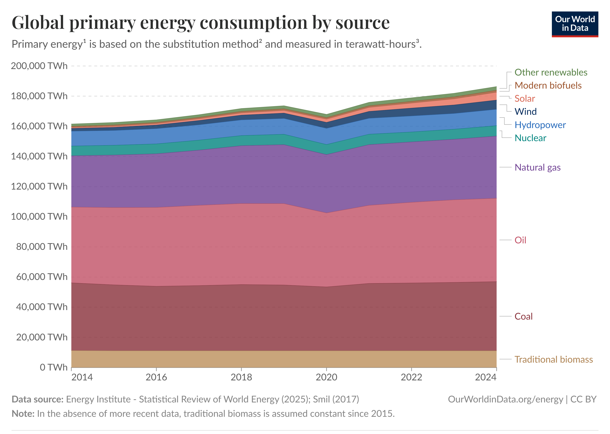
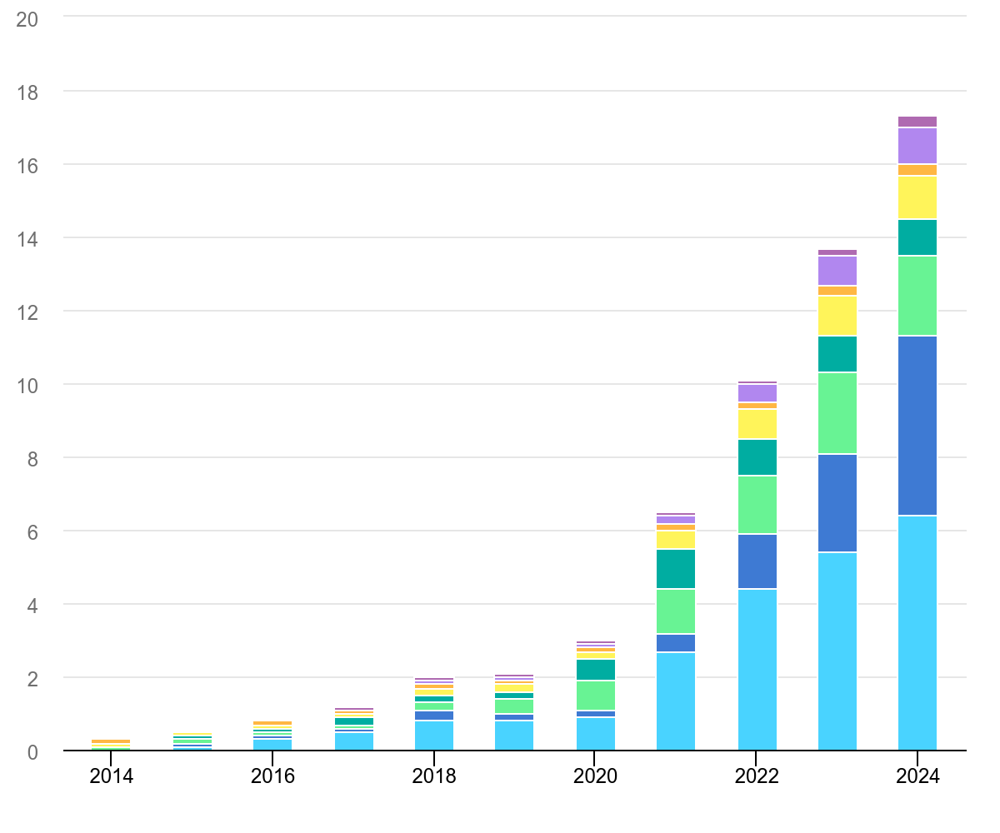

# Electric Vehicle Charging Load Forecasting
<!-- PROJECT LOGO -->
<br />
<p align="center">
  <a href="https://github.com/catiaspsilva/README-template">
    
  </a>


<!-- TABLE OF CONTENTS -->
<details open="open">
  <summary>Table of Contents</summary>
  <ol>
    <li>
      <a href="#about-the-project">About The Project</a>
      <ul>
        <li><a href="#ev-data">EV data</a></li>
        <li><a href="#traffic-data">Traffic data</a></li>
        <li><a href="#weather-data">Weather data</a></li>
      </ul>
    </li>
    <li>
      <a href="#getting-started">Getting Started</a>
      <ul>
        <li><a href="#dependencies">Dependencies</a></li>
        <li><a href="#installation">Installation</a></li>
      </ul>
    </li>
    <li><a href="#usage">Usage</a></li>
    <li><a href="#roadmap">Roadmap</a></li>
    <li><a href="#license">License</a></li>
    <li><a href="#acknowledgements">Acknowledgements</a></li>
  </ol>
</details>


<!-- ABOUT THE PROJECT -->
## About The Project

[ev_load_fc](https://github.com/CammN/ev_load_fc)

This project aims to forecast energy demand (load) from electric-vehicle (EV) charging stations in the Palo Alto, California area. It utilises publicly available data on individual charging events and local traffic and weather patterns. <br />
Energy load forecasting is increasingly in demand due to ever higher global energy consumption and the rapid digitalisation of electricity networks. Over the past decade, global energy consumption has increased by roughly 15%<sup>1</sup>, while global EV sales have grown by more than 5000%<sup>2</sup>. As electricity networks expand to meet this growth, so does the need for reliable, data-driven load forecasting<sup>3<sup>.

The data for this project was found through the Kaggle dataset [EV CHARGING WITH WEATHER AND TRAFFIC DATASET](https://www.kaggle.com/datasets/sanskritirai31/ev-charging-with-weather-and-traffic-dataset) by Sanskriti Rai.

### EV data
The [EV charging dataset](https://data.paloalto.gov/dataviews/257812/ELECT-VEHIC-CHARG-STATI-83602/) was sourced from the Palo Alto government website as a part of it's Open Data program. It contains records of individual charging events across several charging stations in the Palo Alto area from July 2011 - December 2020 and provides information on:
1. Energy used in kWh (the target variable we are forecasting)
2. Actual charging duration
3. Event start time, end time
4. Longitude & latitude of the charging station
5. Customer address details
6. Savings metadata (e.g. fuel, green house gases)

### Traffic data
The traffic data originates from the [MapQuest](https://www.mapquest.com/) public API but was collated into the [LSTW: Large-Scale Traffic and Weather Events Dataset](https://smoosavi.org/datasets/lstw) by Sobhan Moosavi et al. The dataset covers the entirety of the USA across from the period of August 2016 to the end of December 2020, with each record representing an individual traffic incident. It provides information on:
1. Type (e.g. congestion, blocked lane, accident) 
2. Severity (0-4)
3. Traffic Message Channel code and description
4. Distance of road affected
5. Incident start and end time
6. Location metadeta

The details of how the data was collected, transformed and explored are described in their 2019 paper [Short and Long-term Pattern Discovery Over Large-Scale
Geo-Spatiotemporal Data](https://arxiv.org/pdf/1902.06792).

### Weather data
The weather data originates from the [Meteostat](https://meteostat.net/en/) public API and is also a part of the LSTW Dataset. It has a similar structure to the traffic data and provides information on:
1. Type (e.g. rain, storm, cold) 
2. Severity (0-4)
5. Incident start and end time
6. Location metadeta

I also decided to extract hourly temperature data from Meteostat using the [Hourly](https://dev.meteostat.net/python/api/hourly/) class as extreme heat is common in California and could affect local behaviour.

Through analysis of the EV datasets a time frame of August 2017 to the end of February 2020 was chosen for this experiment as it maintained a stable (if noisy) level of demand. Future work for this project could be to develop a model that tolerates the shocks to demand caused by the COVID-19 pandemic.

<br />

1. See [Energy Production and Consumption - Our World in Data](https://ourworldindata.org/energy-production-consumption), total global primary energy consumption is recorded to have risen by 15.38% between 2014 and 2024.
<br />
<p align="left">
    
  </a>
<br />

2. See [Trends in electric car markets - IEA](https://www.iea.org/reports/global-ev-outlook-2025/trends-in-electric-car-markets-2), global EV car sales rose from 0.3m in 2014 rto 17.3m in 2024.
<br />
<p align="left">
    
  </a>
<br />

3. An overview of the applications and benefits of high-quality low voltage load forecasting (which EV charging falls under) can be found in Section 1.1 of the 2023 textbook [Core Concepts and Methods in Load Forecasting](https://www.researchgate.net/publication/370416847_Core_Concepts_and_Methods_in_Load_Forecasting_With_Applications_in_Distribution_Networks), an excellent resource that I made use of throughout this project.

<!-- GETTING STARTED -->
## Getting Started

### Dependencies

I chose to develop this project in Visual Studio Code, although any IDE supporting native python and juypter notebooks can be used.  

As this is a pure-python project I chose the package manager [uv](https://docs.astral.sh/uv/) for its simplicity and speed, therefore all python packages and their respective versions are logged in the pyproject.toml and uv.lock files of this repository.

An exhaustive list of python packages will be provided on this projects completion.

### Installation

1. Clone the repo
   ```sh
   git clone https://github.com/CammN/ev_load_fc
   ```
2. Setup your environment using uv

    a) Create virtual environment
    ```sh
    uv venv
    ```
    b) Activate virtual environment
    ```sh
    source .venv/bin/activate   # macOS / Linux
    # OR  
    .\.venv\Scripts\activate    # Windows
    ```
    c) Install dependencies (from pyproject.toml)
    ```sh
    uv sync
    ```

<!-- USAGE EXAMPLES -->
## Usage


<!-- ROADMAP -->
## Roadmap

See the [open issues](https://github.com/CammN/ev_load_fc/issues) for a list of proposed features.

<!-- LICENSE -->
## License

Distributed under the MIT License. See `LICENSE` for more information.

<!-- ACKNOWLEDGEMENTS -->
## Acknowledgements

* [Sanskriti Rai](https://www.kaggle.com/datasets/sanskritirai31/ev-charging-with-weather-and-traffic-dataset)
* [Core Concepts and Methods in Load Forecasting](https://www.researchgate.net/publication/370416847_Core_Concepts_and_Methods_in_Load_Forecasting_With_Applications_in_Distribution_Networks)
* [City of Palo Alto](https://data.paloalto.gov/dataviews/257812/ELECT-VEHIC-CHARG-STATI-83602/)
* [LSTW: Large-Scale Traffic and Weather Events Dataset](https://smoosavi.org/datasets/lstw)
* [Meteostat](https://meteostat.net/en/)

## Thank you

<!-- If this is useful: [](https://www.buymeacoffee.com/catiaspsilva) -->
